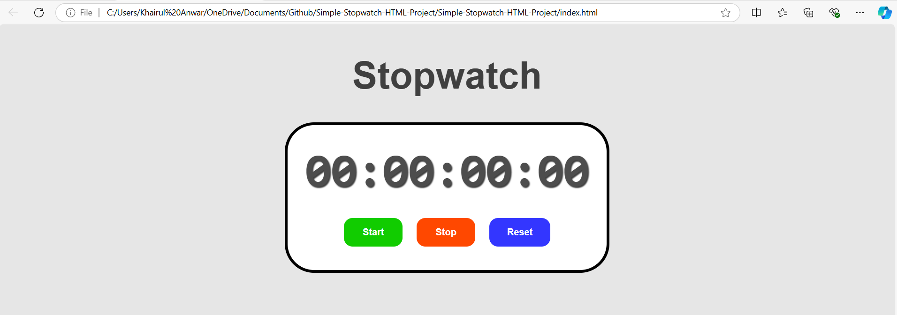

# Simple Stopwatch

A simple stopwatch application built with HTML, CSS, and JavaScript. This project provides a straightforward and user-friendly interface for timing events.

## Features

- **Start, Stop, and Reset:** Control the stopwatch with start, stop, and reset functionalities.
- **Responsive Design:** The interface is optimized for both desktop and mobile devices.
- **Real-Time Display:** The stopwatch updates in real-time, showing minutes and seconds.

## Technologies Used

- **HTML:** For the structure of the application.
- **CSS:** To style the user interface and enhance appearance.
- **JavaScript:** To implement the stopwatch functionality and handle time calculations.

